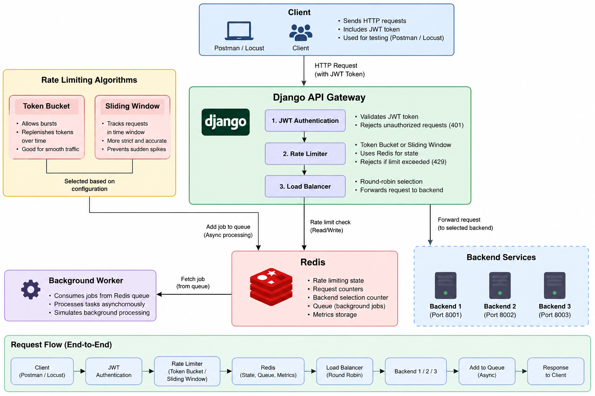

# Distributed Rate Limiter & API Gateway

A Django-based API gateway that demonstrates distributed rate limiting, JWT authentication, Redis-backed state management, round-robin load balancing, Redis-based job queuing, gateway metrics, and load testing with Locust.

---

## 🚀 Features

- JWT-based authentication using SimpleJWT
- Redis-backed Token Bucket rate limiting
- Redis-backed Sliding Window rate limiting
- Configurable rate-limiting algorithm
- Atomic Token Bucket updates using Redis Lua scripting
- Round-robin load balancing across three mock backends
- Redis List-based FIFO queue
- Simple background worker for queued jobs
- Redis-based request and backend metrics
- Load testing with Locust
- Basic performance comparison of rate-limiting algorithms

---

## 🏗️ Architecture



### Request Flow

```
Client
  │
  │ JWT Request
  ▼
Django API Gateway
  │
  ├── JWT Authentication
  │
  ▼
Rate Limit Selector
  │
  ├── Token Bucket
  │
  └── Sliding Window
          │
          ▼
        Redis
          │
          ▼
    Rate Limit Check
       │       │
       │       └── Exceeded → 429
       │
       ▼
  Round-Robin Load Balancer
       │
       ├── Backend 1
       ├── Backend 2
       └── Backend 3
       │
       ▼
   Redis Queue
       │
       ▼
     Worker
```

**Request Processing**

1. The client sends an HTTP request with a JWT access token.
2. Django authenticates the JWT and identifies the user.
3. The gateway checks the configured rate-limiting algorithm.
4. Redis stores and manages the rate-limiter state.
5. If the rate limit is exceeded, the gateway returns `429 Too Many Requests`.
6. Allowed requests are passed to the round-robin load balancer.
7. The load balancer selects one of the three mock backends.
8. The request is added to a Redis queue.
9. A worker consumes jobs from the queue.
10. Gateway metrics are stored in Redis.

---

## 🛠️ Tech Stack

| Technology | Purpose |
|---|---|
| Python | Core programming language |
| Django | Web framework |
| Django REST Framework | REST API development |
| SimpleJWT | JWT authentication |
| Redis / Memurai | Shared state, counters, queues and metrics |
| Redis Lua | Atomic Token Bucket operations |
| Locust | Load testing |

---

## 🔐 Authentication

The gateway uses JWT authentication through Django REST Framework SimpleJWT.

**Authentication flow:**

```
Client
   │
   │ POST /api/token/
   ▼
Django
   │
   ├── Access Token
   └── Refresh Token
```

The access token is then included in protected requests:

```
Authorization: Bearer <access_token>
```

Example:

```
GET /api/gateway/
Authorization: Bearer <access_token>
```

The gateway authenticates the token before processing the request.

If authentication succeeds:

```
JWT
 ↓
request.user
 ↓
request.user.id
 ↓
Rate Limiter
```

If the JWT is invalid or expired:

```
HTTP 401 Unauthorized
```

Current project configuration:

```python
ACCESS_TOKEN_LIFETIME = timedelta(minutes=5)
REFRESH_TOKEN_LIFETIME = timedelta(days=1)
```

---

## 🚦 Rate Limiting

The gateway supports two rate-limiting algorithms:

- Token Bucket
- Sliding Window

The active algorithm can be selected through Django settings:

```python
RATE_LIMIT_ALGORITHM = "token_bucket"
```

or:

```python
RATE_LIMIT_ALGORITHM = "sliding_window"
```

The gateway uses a common rate-limit interface so the rest of the gateway does not need to know which algorithm is being used.

### 🪣 Token Bucket

The Token Bucket algorithm maintains a bucket of tokens for each user.

- Each request consumes one token.
- Tokens are replenished over time according to the configured refill rate.

**Current configuration:**

- Bucket capacity: `10` tokens
- Refill rate: `1` token/second

Conceptually:

```
             ┌─────────────────┐
             │   Token Bucket  │
             │                 │
             │  ● ● ● ● ● ●    │
             │  ● ● ● ●        │
             └────────┬────────┘
                       │
                  Request
                       │
                  Consume 1
                       │
               ┌───────┴───────┐
               │               │
           Token exists     No token
               │               │
               ▼               ▼
            Allow             429
```

Redis stores the bucket state for each user. The stored state includes:

- `tokens`
- `last_refill_time`

A user-specific Redis key is used:

```
rate:user:<user_id>
```

### ⚛️ Atomic Token Bucket Operations

A rate limiter can suffer from race conditions when multiple requests access the same state simultaneously. For example:

```
Request A → Read tokens
Request B → Read tokens
Request A → Update tokens
Request B → Update tokens
```

Both requests could potentially operate on stale state.

To avoid this, the Token Bucket implementation uses a **Redis Lua script**. The script performs the read, calculation, and update on the Redis server as one atomic operation, keeping the token bucket state consistent when multiple requests arrive concurrently.

### 🪟 Sliding Window

The Sliding Window algorithm limits requests within a specific time period.

**Current configuration:**

- Limit: `10` requests
- Window: `60` seconds

The algorithm uses a Redis Sorted Set (`ZSET`). Each request is stored using:

```
timestamp → score
```

The Redis key is:

```
rate:sliding:user:<user_id>
```

For every request:

1. Remove expired timestamps
2. Count remaining requests
3. Check the limit
4. Reject or accept
5. Add the current timestamp if accepted

Conceptually:

```
60-second window
─────────────────────────────────────
       ●     ●  ●       ●    ●
       │     │  │       │    │
     Request timestamps
─────────────────────────────────────

If count >= 10
       ↓
    HTTP 429
```

### 🔄 Rate Limit Selection

The gateway uses a selector:

```
                 Gateway
                    │
                    ▼
           Rate Limit Selector
              │           │
              ▼           ▼
        Token Bucket   Sliding Window
              │           │
              └─────┬─────┘
                     ▼
                   Redis
```

This allows the same gateway endpoint to be tested with either algorithm.

---

## ⚖️ Load Balancing

The gateway implements a simple round-robin load balancer.

Three mock backends are available:

- Backend 1
- Backend 2
- Backend 3

A Redis counter tracks the next backend.

Redis key:

```
gateway:backend_counter
```

For every accepted request:

```python
counter = r.incr("gateway:backend_counter")
```

The backend is selected using:

```python
backend_number = ((counter - 1) % 3) + 1
```

This produces:

```
Request 1 → Backend 1
Request 2 → Backend 2
Request 3 → Backend 3
Request 4 → Backend 1
Request 5 → Backend 2
Request 6 → Backend 3
```

Redis `INCR` is atomic, allowing the counter to be shared safely through Redis.

---

## 📦 Redis Queue

Accepted requests are also added to a Redis List queue.

Redis key:

```
gateway:queue
```

The project uses `LPUSH` and `RPOP` to create FIFO behavior.

For example:

```
LPUSH job1
LPUSH job2
LPUSH job3
```

The queue internally becomes:

```
job3
job2
job1
```

Using `RPOP` processes:

```
job1
job2
job3
```

Therefore: **LPUSH + RPOP = FIFO**

---

## 👷 Worker

The project includes a simple worker that consumes jobs from the Redis queue.

The worker:

1. Reads a job using `RPOP`.
2. Processes the job.
3. Continues until the queue is empty.

The worker can be executed using:

```python
from gateway.worker import process_queue

process_queue()
```

Example output:

```
processing : Request from Backend 1
processing : Request from Backend 2
processing : Request from Backend 3
```

The worker is intentionally implemented as a simple Redis worker rather than introducing a task-processing framework such as Celery.

---

## 📊 Metrics

The gateway stores basic metrics in Redis. Metrics include:

- Total accepted requests
- Rejected requests
- Backend 1 requests
- Backend 2 requests
- Backend 3 requests

The metrics endpoint is:

```
GET /api/metrics/
```

Example response:

```json
{
    "total_requests": 34,
    "rejected_requests": 33,
    "backend1": 12,
    "backend2": 11,
    "backend3": 11
}
```

The backend counts should equal the total accepted requests:

```
12 + 11 + 11 = 34
```

This also provides a simple way to verify that round-robin load balancing is functioning.

---

## 🧪 Load Testing

Locust was used to simulate multiple clients sending requests to the gateway.

The test targeted:

```
GET /api/gateway/
```

Example configuration:

- Users: `5`
- Spawn rate: `1 user/second`
- Host: `http://127.0.0.1:8000`

The Locust test reads the JWT access token from the `LOCUST_ACCESS_TOKEN` environment variable and sends it with each request.

### Token Bucket Load Test

| Metric | Value |
|---|---|
| Total Requests | 224 |
| Successful Requests | 80 |
| 429 Responses | 144 |
| Requests/sec | 3.4 |
| Median Response Time | 4 ms |
| 95th Percentile | 6 ms |

The test demonstrated that the Token Bucket rate limiter successfully rejected requests after the configured token capacity was exhausted.

### Sliding Window Load Test

| Metric | Value |
|---|---|
| Total Requests | 189 |
| Successful Requests | 15 |
| 429 Responses | 174 |
| Requests/sec | 3.3 |
| Median Response Time | 5 ms |
| 95th Percentile | 11 ms |

The test demonstrated that the Sliding Window limiter correctly rejected requests once the configured request limit was reached.

> These benchmark runs were performed during development to demonstrate system behavior. They should not be interpreted as production performance benchmarks.

### 📈 Load Test Observations

The Locust tests demonstrated the complete gateway flow:

```
Locust
   ↓
JWT Authentication
   ↓
Rate Limiting
   ↓
Redis
   ↓
Round-Robin Load Balancer
   ↓
Backend 1 / 2 / 3
   ↓
Redis Queue
   ↓
Worker
```

The tests also demonstrated:

- Valid JWT requests reach the gateway.
- Invalid or expired JWTs return `401 Unauthorized`.
- Requests exceeding the rate limit return `429 Too Many Requests`.
- Accepted requests are distributed across the three backends.
- Redis maintains shared gateway state.
- Gateway metrics track accepted and rejected traffic.

---

## 🔌 API Endpoints

| Method | Endpoint | Authentication | Description |
|---|---|---|---|
| POST | `/api/token/` | No | Obtain JWT access and refresh tokens |
| POST | `/api/token/refresh/` | No | Refresh an access token |
| GET | `/api/redis-test/` | No | Test Django ↔ Redis connectivity |
| GET | `/api/health/` | JWT | Health check |
| GET | `/api/healthview/` | JWT | Rate-limited health endpoint |
| GET | `/api/gateway/` | JWT | Main gateway endpoint |
| GET | `/api/backend1/` | No | Mock Backend 1 |
| GET | `/api/backend2/` | No | Mock Backend 2 |
| GET | `/api/backend3/` | No | Mock Backend 3 |
| GET | `/api/metrics/` | No | Gateway metrics |

---

## 📁 Project Structure

```
gateway_project/
│
├── manage.py
├── README.md
├── ARCHITECTURE.md
├── image.png
├── locustfile.py
├── rate_limiter.lua
│
├── gateway/
│   ├── __init__.py
│   ├── admin.py
│   ├── apps.py
│   ├── load_balancer.py
│   ├── models.py
│   ├── queue.py
│   ├── rate_limit.py
│   ├── rate_limiter.py
│   ├── sliding_window.py
│   ├── tests.py
│   ├── urls.py
│   ├── views.py
│   ├── worker.py
│   └── migrations/
│
└── gateway_project/
    ├── __init__.py
    ├── asgi.py
    ├── settings.py
    ├── urls.py
    └── wsgi.py
```

---

## ⚙️ Setup

### 1. Clone the repository

```bash
git clone https://github.com/adityachillarge005/Distributed-Rate-Limiter-API-Gateway.git
cd Distributed-Rate-Limiter-API-Gateway
```

### 2. Create a virtual environment

```bash
python -m venv myenv
```

Activate it on Windows (PowerShell):

```powershell
.\myenv\Scripts\Activate.ps1
```

### 3. Install dependencies

```bash
pip install -r requirements.txt
```

### 4. Start Redis / Memurai

Make sure Redis-compatible Memurai is running on:

```
127.0.0.1:6379
```

### 5. Run migrations

```bash
python manage.py migrate
```

### 6. Create a superuser

```bash
python manage.py createsuperuser
```

### 7. Start Django

```bash
python manage.py runserver
```

The API will be available at:

```
http://127.0.0.1:8000
```

---

## 🧪 Running Locust

Before starting Locust, set the access token.

### Windows PowerShell

```powershell
$env:LOCUST_ACCESS_TOKEN="your_access_token_here"
locust
```

Open the Locust dashboard:

```
http://localhost:8089
```

Configure:

- Users: `5`
- Spawn rate: `1`
- Host: `http://127.0.0.1:8000`

The Locust test reads the JWT access token from the `LOCUST_ACCESS_TOKEN` environment variable.

---

## 🔄 Switching Rate-Limiting Algorithms

Open `gateway_project/settings.py`.

For Token Bucket:

```python
RATE_LIMIT_ALGORITHM = "token_bucket"
```

For Sliding Window:

```python
RATE_LIMIT_ALGORITHM = "sliding_window"
```

Restart Django after changing the setting.

---

## 🧠 Concepts Demonstrated

This project was built to understand how several backend and distributed-system concepts work together.

**Backend Development**
- Django
- Django REST Framework
- REST APIs
- API routing
- Authentication
- Permissions

**Authentication**
- JWT
- Access tokens
- Refresh tokens
- `request.user`
- User IDs
- Authentication vs authorization

**Redis**
- SET / GET
- INCR
- EXPIRE
- TTL
- Hashes
- Sorted Sets
- Lists
- Atomic operations
- Lua scripting

**Rate Limiting**
- Token Bucket
- Sliding Window
- Request limits
- Refill rates
- Time windows
- Race conditions
- Atomic state updates

**Distributed Systems**
- Shared Redis state
- Atomic counters
- Load balancing
- Request queues
- Background workers
- Distributed metrics

**Testing**
- Locust
- Concurrent simulated users
- RPS
- Response latency
- 429 rate-limit responses
- Authentication failures

---

## 🎯 Project Goal

The main goal of this project was to understand the internal flow of an API gateway and how Redis can be used to coordinate shared state across gateway components.

Instead of relying entirely on pre-built infrastructure, the project implements the core mechanisms manually:

```
JWT Authentication
        ↓
Rate Limiting
        ↓
Redis Shared State
        ↓
Load Balancing
        ↓
Redis Queue
        ↓
Worker
        ↓
Metrics
        ↓
Load Testing
```

---

## 👨‍💻 Author

Built as a hands-on backend systems project to understand how API gateways, Redis, rate limiting, authentication, load balancing, queues, workers, and distributed state management work together.
